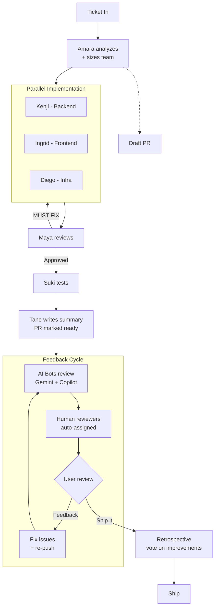
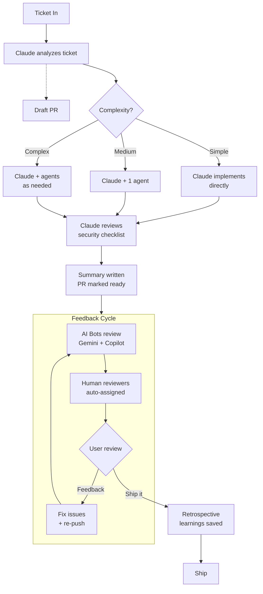
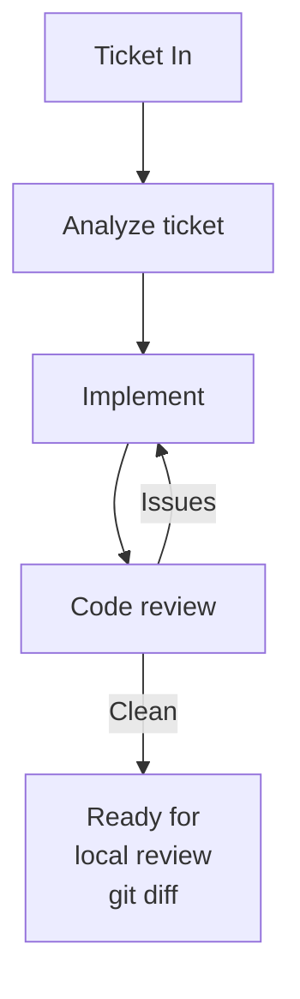

```
██████╗ ██████╗ ███████╗ █████╗ ███╗   ███╗    ████████╗███████╗ █████╗ ███╗   ███╗
██╔══██╗██╔══██╗██╔════╝██╔══██╗████╗ ████║    ╚══██╔══╝██╔════╝██╔══██╗████╗ ████║
██║  ██║██████╔╝█████╗  ███████║██╔████╔██║       ██║   █████╗  ███████║██╔████╔██║
██║  ██║██╔══██╗██╔══╝  ██╔══██║██║╚██╔╝██║       ██║   ██╔══╝  ██╔══██║██║╚██╔╝██║
██████╔╝██║  ██║███████╗██║  ██║██║ ╚═╝ ██║       ██║   ███████╗██║  ██║██║ ╚═╝ ██║
╚═════╝ ╚═╝  ╚═╝╚══════╝╚═╝  ╚═╝╚═╝     ╚═╝       ╚═╝   ╚══════╝╚═╝  ╚═╝╚═╝     ╚═╝

                              F   L   O   W
                                              ╔══════════╗
                                              ║   BETA   ║
                                              ╚══════════╝
```

> **Beta** — Actively developed and used in production, but expect breaking changes between updates. Feedback and contributions welcome.

**A multi-agent team powered by [Claude Code](https://docs.anthropic.com/en/docs/claude-code) that takes a ticket and delivers a complete implementation — architecture, code, review, testing, and PR — autonomously.**

Dream Team Flow is a set of Claude Code custom commands, scripts, and specialized agents that orchestrate a team of AI developers. Give it a Jira ticket, and it handles everything: workspace setup, architecture analysis, parallel implementation, code review, testing, PR creation, and cleanup.

**Built for teams.** One command to install, one command to update. Share a company config with your team to auto-configure service names, Jira domain, paths, and conventions — new developers are productive in minutes. Retro learnings aggregate across the team via PRs. Works on macOS, Linux, and Windows (WSL) with 10 supported terminals.

---

## Documentation

| Guide | Description |
|-------|-------------|
| **[README](README.md)** | Overview, quick start, usage, and feature reference (this file) |
| **[Setup Guide](SETUP-GUIDE.md)** | Prerequisites, installation, company config, DTF CLI reference, troubleshooting |
| **[The Team](docs/the-team.md)** | Agent roster, roles, dynamic team sizing, agent definitions |
| **[Security Guide](SECURITY.md)** | Security ladder (3 levels), sandbox, network isolation, deny rules, `--dangerously-skip-permissions` explained |
| **[Integrations](docs/integrations.md)** | Hooks, subagents, GitHub Actions, Slack, terminal support |

> **Key security insight:** `--dangerously-skip-permissions` only skips interactive prompts — deny rules, sandbox, and network restrictions are **always enforced**. See [SECURITY.md](SECURITY.md) for the full security model.

---

## How It Works

```
Ticket → Architect → Parallel Dev → Code Review → Test → PR → Human Review → Ship
```

1. **You say:** `/create-stories PROJ-1234`
2. **Dream Team does:**
   - Fetches the Jira ticket
   - Creates a git worktree and branch
   - Installs dependencies
   - Opens a terminal with a Claude Code session
   - Spawns a team of specialized agents
   - Implements the feature in parallel
   - Reviews the code for security and conventions
   - Creates a draft PR with structured description
   - Waits for your feedback
   - Cleans up when done

---

## Quick Start

### Prerequisites

- [Claude Code CLI](https://docs.anthropic.com/en/docs/claude-code) installed
- [Homebrew](https://brew.sh) (macOS/Linux)
- Git, Node.js (via nvm), jq
- A terminal (10 supported — see below)

### Install (one command)

```bash
# Clone and run the installer:
git clone https://github.com/your-username/dream-team-flow.git
bash dream-team-flow/scripts/dtf.sh install https://github.com/your-username/dream-team-flow

# Install CLI tools:
brew install tmux jq
```

The installer:
1. Asks your name, GitHub username, monorepo path, and terminal preference
2. Symlinks all commands, scripts, agents, and skills into `~/.claude/`
3. Generates your personal `CLAUDE.md` with your settings
4. Merges hooks into `settings.json`

### Team / Enterprise Install

If your team lead shared a `company-config.json`, pass it during install to auto-configure everything:

```bash
bash dream-team-flow/scripts/dtf.sh install https://github.com/your-org/dream-team-flow \
  --company-config ~/Downloads/company-config.json
```

This de-sanitizes all generic names (Repo, ServiceA, PROJ-) with your company's real names, sets default paths, and asks about any project-specific paths your team uses.

### Update

```bash
dtf update    # Pull latest, verify symlinks, regenerate CLAUDE.md
dtf doctor    # Health check — config, symlinks, tools
```

### Supported Terminals (10)

| Terminal | macOS | Linux | Windows (WSL) |
|----------|-------|-------|---------------|
| Alacritty | yes | yes | yes |
| Kitty | yes | yes | - |
| WezTerm | yes | yes | yes |
| Ghostty | yes | yes | - |
| Warp | yes | yes | - |
| Terminal.app | yes | - | - |
| iTerm/iTerm2 | yes | - | - |
| GNOME Terminal | - | yes | - |
| Konsole | - | yes | - |
| Windows Terminal | - | - | yes |

---

## Usage

### Full Lifecycle (recommended)

Handles everything end-to-end: Jira fetch, worktree creation, dependency install, team launch, PR creation, and cleanup.

```
/create-stories PROJ-1234
```

Multiple tickets:

```
/create-stories PROJ-1234 PROJ-1235
```

### Standalone Team

Already have a branch? Run the team directly:

```
/my-dream-team <paste ticket description or Jira ID>
```

### Lite Mode (Claude decides agent usage)

Claude analyzes the ticket and decides whether to spawn agents or work solo. Still does everything else: PRs, Jira updates, summaries, retro, GitHub review handling.

```
/my-dream-team --lite <ticket description>
/create-stories PROJ-1234 --lite
```

### No Worktree (work in current directory)

Skip worktree creation — work on the current branch in the current directory:

```
/my-dream-team --no-worktree <ticket description>
/create-stories PROJ-1234 --no-worktree
```

### Local Only (no PR, no push)

Skip all git remote operations:

```
/my-dream-team --local <paste ticket description>
```

### Combined Flags

Flags can be mixed:

```
/my-dream-team --lite --no-worktree <ticket description>
/my-dream-team --lite --local <ticket description>
/create-stories PROJ-1234 --lite --no-worktree
```

### PR Review

Review any pull request with line-level comments — no local checkout needed:

```
/review-pr 1670
/review-pr 1670 --focus "src/components/**" --no-approve
```

### PR Reviewer Auto-Assignment

Configure GitHub reviewers per category. When a Dream Team PR is marked ready, reviewers are auto-assigned based on the ticket scope.

```
# Manage reviewers
/reviewers list
/reviewers add frontend github-user-1
/reviewers add backend github-user-2
/reviewers remove infra github-user-3
```

Categories: `frontend`, `backend`, `fullstack`, `infra`, `data`

Config stored in `~/.claude/reviewers.json` — sanitized automatically for public repos (usernames replaced with `reviewer-1`, `reviewer-2`, etc.).

When the Dream Team marks a PR ready (Phase 5.5), it maps the ticket scope to a category (`frontend-only` → `frontend`, `full-stack` → `fullstack`, etc.) and runs `gh pr edit --add-reviewer` with all configured reviewers for that category.

### Pause & Resume

```
# Close for the day (keeps worktree, kills tmux)
"pause PROJ-1234"

# Continue tomorrow (rebuilds context from agent notes)
"resume PROJ-1234"
```

---

## The Team

11 specialized agents — architect, backend/frontend developers, data engineer, infra, reviewer, tester, visual verifier, and summary writer. The architect analyzes each ticket and dynamically spawns only the agents needed: 2-3 for simple changes, the full team for complex multi-service work.

Read more: **[The Team](docs/the-team.md)** — full agent roster, team sizing logic, and agent definitions.

---

## Workflow Phases

### Full Mode (default)

Multi-agent team with full orchestration.



### Lite Mode (`--lite`)

Claude works solo or selectively spawns agents. Same quality gates and feedback cycle.



### Local Mode (`--local`)

No PR, no push. Stops after review.



### Mode Comparison

| Feature | Full | Lite | Local |
|---------|:----:|:----:|:-----:|
| Architecture analysis | Amara | Claude | Claude |
| Implementation | Parallel agents | Claude decides | Claude decides |
| Code review | Maya | Claude or Maya | Claude or Maya |
| Draft PR | yes | yes | - |
| AI bot feedback | yes | yes | - |
| Human reviewer assignment | yes | yes | - |
| User feedback loop | yes | yes | - |
| Summary | Tane | Claude | - |
| Retrospective | yes | yes | - |
| Jira transitions | yes | yes | - |

Add `--no-worktree` to any mode to skip worktree creation and work in the current directory.

---

## Retrospectives & Learning Router

Every Dream Team session ends with a retrospective. Agents reflect on what worked and what didn't, vote on improvements, and tag each learning with a **destination** — where it should be applied.

### How it works

1. **Retro runs** (Phase 6.75) — agents propose improvements tagged with destinations
2. **Learnings accumulate** in a session log (`dream-team-learnings.md`)
3. **`/team-review`** analyzes patterns across sessions and routes learnings

### Where learnings go

| Destination | Example | Apply mode |
|-------------|---------|------------|
| Dream Team command | "Kenji should share API contracts earlier" | Direct (personal config) |
| Standalone agent | "Architect must check API endpoint existence" | Direct (personal config) |
| Skill/command | "review-pr should verify API contracts" | Direct (personal config) |
| Project CLAUDE.md | "Use Dapper for heavyweight SQL" | Ticket + PR |
| AGENTS.md | "HCM uses soft deletes" | Ticket + PR |
| Repo docs | "Date helper convention" | Ticket + PR |

**Direct apply** — personal config files in `~/.claude/` are edited immediately and synced with `/sync-config`.

**Ticket + PR** — shared repo files that affect the whole team are never written directly. Instead, `/team-review` creates a Jira ticket and a draft PR so the team can review the changes.

### ⌨️ Key commands

| Step | Command | What happens |
|------|---------|-------------|
| 1 | <kbd>/create-stories PROJ-1234</kbd> | Work on tickets — retros run automatically at session end |
| | <kbd>/my-dream-team --lite ...</kbd> | |
| 2 | <kbd>/team-review</kbd> | Review accumulated learnings and route them (every 5-10 sessions) |
| 3 | <kbd>/review-pr \<PR number\></kbd> | Review the PR that `/team-review` created for shared repo changes |
| 4 | <kbd>/sync-config</kbd> | Sync personal config changes to your config repo |

### The feedback loop

```
Session retro → learnings tagged → /team-review routes them
                                        ├── Personal config → direct apply
                                        │                     └── /sync-config
                                        └── Shared repo → Jira ticket + draft PR
                                                          └── /review-pr → team merges
```

This means Dream Team retros improve not just the Dream Team — they improve **every Claude session** in the project. Learnings routed to `CLAUDE.md` or `AGENTS.md` are picked up by raw Claude, lite mode, subagents, and any team member who pulls the changes.

---

## Key Features

- 🚀 **One-command team setup** — `dtf install` symlinks everything, generates config, merges hooks — new team members are productive in minutes
- 🏢 **Company config** — Share a `company-config.json` to auto-configure service names, Jira domain, paths for your whole team
- 🧠 **Shared learnings** — `dtf contribute` exports retro insights as PRs; team curates into shared knowledge base
- ⚡ **Lite mode** — `--lite` flag lets Claude decide whether to spawn agents or work solo, keeping all quality gates intact
- 📂 **No-worktree mode** — `--no-worktree` flag to work in-place without workspace setup/cleanup
- 📐 **Dynamic team sizing** — Architect analyzes complexity and spawns only the agents needed
- 🔀 **Parallel implementation** — Backend and frontend work simultaneously using a shared API contract
- 💬 **Structured agent communication** — Handoffs include files touched, ports, commands, contract deviations
- 💾 **Working notes & crash recovery** — Agents write to `.dream-team/notes/` on disk; crashed agents respawn with full context
- 🔄 **Retrospectives & self-learning** — Every session ends with a team retro: agents vote on improvements, learnings are tagged with destinations and saved for routing
- 🗺️ **Learning Router** — `/team-review` analyzes accumulated retro learnings and routes them to the right place: personal config files are applied directly, shared repo files (CLAUDE.md, AGENTS.md, docs/) go through Jira ticket + PR for team review
- ⏸️ **Pause/resume** — Close for the day, pick up tomorrow with context rebuilt from persistent notes
- 🧹 **Orchestrator cleanup** — Worktree removal, branch deletion, tmux kill handled from outside the workspace
- 🔃 **Merge conflict prevention** — Pulls latest main before branching, rebases before every push
- 🛡️ **Non-destructive PR updates** — Reads current PR body before editing, preserving manually added images
- 🤖 **AI review polling** — Waits for GitHub AI bots (Gemini, Copilot) before human review
- ✅ **CI check polling** — Monitors GitHub Actions, routes failures to the right agent
- 🚧 **Guardrail hooks** — Migration guard, lock file guard, auto-lint reminders prevent common mistakes
- 👁️ **Visual verification** — Frontend devs can verify against designs using Chrome extension
- 🔒 **Security scanning** — Every PR gets a 6-category OWASP-aligned security review
- 👥 **PR reviewer auto-assignment** — Pre-configure GitHub reviewers per category (frontend, backend, fullstack, infra, data); auto-assigned when PRs go ready
- 🔎 **Standalone PR review** — Review any PR with `/review-pr`, no local checkout needed
- 📋 **How to Test section** — Every PR includes exact URLs, steps, and expected results
- 🖥️ **10 terminals supported** — macOS, Linux, and Windows (WSL) across Alacritty, Kitty, WezTerm, Ghostty, Warp, and more

---

## Tech Stack

Built for monorepos with:
- **Frontend:** React, TypeScript, Vite, Tailwind CSS, RTK Query
- **Backend:** .NET Web API, Entity Framework Core, C#
- **Infrastructure:** Docker Compose, EF Core Migrations

The agent prompts reference these technologies, but the framework is adaptable. You can modify the agent definitions in `commands/my-dream-team.md` to match your stack.

---

## Project Structure

```
dream-team-flow/                  # Public repo (or company fork)
  .gitignore                      # Ignores dtf-config.json (personal)
  README.md                       # This file
  SETUP-GUIDE.md                  # Detailed setup reference
  SECURITY.md                     # Security ladder, sandbox, permissions guide
  CLAUDE.md.template              # Template → generates ~/.claude/CLAUDE.md
  dtf-config.template.json        # Template for per-user config
  company-config.example.json     # Example company config with docs
  reviewers.json                  # PR reviewer assignments per category
  settings.json                   # Claude Code settings (hooks, env)
  commands/
    create-stories.md             # /create-stories — full lifecycle
    my-dream-team.md              # /my-dream-team — agent team
    workspace-launch.md           # /workspace-launch — create worktree
    workspace-cleanup.md          # /workspace-cleanup — tear down
    review-pr.md                  # /review-pr — standalone PR review
    reviewers.md                  # /reviewers — manage PR reviewer assignments
    acli-jira-cheatsheet.md       # Jira CLI reference
    security-setup.md             # Interactive security configuration
    ticket-scout.md               # Pre-sprint ticket analysis
    team-stats.md                 # Session statistics
    team-review.md                # Team performance review
  scripts/
    dtf.sh                        # DTF CLI (install, update, doctor, contribute)
    dtf-env.sh                    # Config loader for shell scripts
    launch-workspace.sh           # Terminal launcher (starts Claude in tmux)
    open-terminal.sh              # Cross-platform terminal opener (10 terminals)
    resume-workspace.sh           # Resume paused workspace
    pause-workspace.sh            # Pause workspace for the day
    poll-ai-reviews.sh            # Poll for AI bot reviews
    poll-ci-checks.sh             # Poll GitHub Actions
    chrome-queue.sh               # Chrome browser queue
    migration-guard.sh            # Hook: warns on migration edits
    lockfile-guard.sh             # Hook: warns on lock file edits
    auto-lint-notify.sh           # Hook: lint reminders for .cs/.ts/.tsx
  agents/
    architect.md                  # Architecture analysis subagent
    backend-dev.md                # .NET backend implementation
    frontend-dev.md               # React/TypeScript frontend
    pr-reviewer.md                # Code review subagent
    data-engineer.md              # Data mapping & migrations
  skills/
    mermaid-diagram/              # Mermaid diagram generation
  security/
    level-1-personal.json         # Personal baseline (sandbox + deny rules)
    level-2-project.json          # Project standard (shared allowlist)
    level-3-team.json             # Team enforced (managed lockdown)
  docs/
    the-team.md                   # Agent roster, roles, team sizing
    integrations.md               # Integration reference & setup
  learnings/
    aggregated-learnings.md       # Team-curated retro learnings
    contributions/                # Per-user retro submissions
```

After `dtf install`, everything is symlinked into `~/.claude/` — updates are instant via `git pull`.

---

## Further Reading

- **[Setup Guide](SETUP-GUIDE.md)** — Prerequisites, company config, DTF CLI reference, full lifecycle walkthrough, troubleshooting
- **[Security Guide](SECURITY.md)** — Security ladder (Levels 1-3), sandbox deep dive, network proxy, permission rules, settings hierarchy, auditing
- **[Integrations](docs/integrations.md)** — Hooks, subagents, GitHub Actions, Slack integration, terminal support

---

## Contributing

This is an actively evolving project. Contributions are welcome:

- **Workflow improvements:** After Dream Team sessions, run `dtf contribute` to export your retro learnings as a PR
- **New agent types:** Add agent definitions to `agents/` for your tech stack
- **Terminal support:** Add new terminals to `scripts/open-terminal.sh`
- **Bug fixes & features:** Standard GitHub PR workflow

---

## License

MIT
