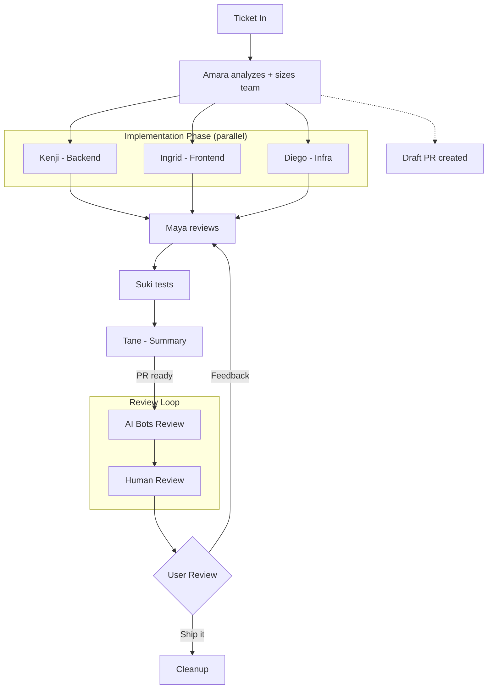

```
██████╗ ██████╗ ███████╗ █████╗ ███╗   ███╗    ████████╗███████╗ █████╗ ███╗   ███╗
██╔══██╗██╔══██╗██╔════╝██╔══██╗████╗ ████║    ╚══██╔══╝██╔════╝██╔══██╗████╗ ████║
██║  ██║██████╔╝█████╗  ███████║██╔████╔██║       ██║   █████╗  ███████║██╔████╔██║
██║  ██║██╔══██╗██╔══╝  ██╔══██║██║╚██╔╝██║       ██║   ██╔══╝  ██╔══██║██║╚██╔╝██║
██████╔╝██║  ██║███████╗██║  ██║██║ ╚═╝ ██║       ██║   ███████╗██║  ██║██║ ╚═╝ ██║
╚═════╝ ╚═╝  ╚═╝╚══════╝╚═╝  ╚═╝╚═╝     ╚═╝       ╚═╝   ╚══════╝╚═╝  ╚═╝╚═╝     ╚═╝

                              F   L   O   W
```

**A multi-agent team powered by [Claude Code](https://docs.anthropic.com/en/docs/claude-code) that takes a ticket and delivers a complete implementation — architecture, code, review, testing, and PR — autonomously.**

Dream Team Flow is a set of Claude Code custom commands and scripts that orchestrate a team of specialized AI agents. Give it a Jira ticket, and it handles everything: workspace setup, architecture analysis, parallel implementation, code review, testing, PR creation, and cleanup.

---

## How It Works

```
Ticket → Architect → Parallel Dev → Code Review → Test → PR → Human Review → Ship
```

1. **You say:** `/create-stories PROJ-1234`
2. **Dream Team does:**
   - Fetches the Jira ticket
   - Creates a git worktree and branch
   - Installs dependencies
   - Opens a terminal with a Claude Code session
   - Spawns a team of specialized agents
   - Implements the feature in parallel
   - Reviews the code for security and conventions
   - Creates a draft PR with structured description
   - Waits for your feedback
   - Cleans up when done

---

## Quick Start

### Prerequisites

- [Claude Code CLI](https://docs.anthropic.com/en/docs/claude-code) installed
- [Homebrew](https://brew.sh)
- Git, Node.js (via nvm)
- A terminal: Alacritty, Terminal.app, or iTerm

### Install

```bash
git clone https://github.com/your-username/dream-team-flow.git
cd dream-team-flow

# Create directories
mkdir -p ~/.claude/{commands,scripts,skills/mermaid-diagram}

# Copy everything
cp commands/*.md ~/.claude/commands/
cp scripts/*.sh ~/.claude/scripts/
chmod +x ~/.claude/scripts/*.sh
cp skills/mermaid-diagram/*.md ~/.claude/skills/mermaid-diagram/
cp CLAUDE.md ~/.claude/CLAUDE.md
cp settings.json ~/.claude/settings.json

# Install CLI tools
brew install tmux
brew tap atlassian/homebrew-acli
brew install acli

# Authenticate Jira
acli jira auth login --web
```

Then edit `~/.claude/CLAUDE.md` to configure your repo path and terminal preference.

### Customize for Your Project

The commands use generic placeholder names. Replace them with your project's names:

```bash
cd ~/.claude
sed -i '' \
  -e 's/Repo/YourProject/g' \
  -e 's/repo/your-project/g' \
  -e 's/ServiceA/YourFirstService/g' \
  -e 's/ServiceB/YourSecondService/g' \
  commands/*.md scripts/*.sh CLAUDE.md
```

See [NAME-MAPPING.md](NAME-MAPPING.md) for the full mapping table.

---

## Usage

### Full Lifecycle (recommended)

Handles everything end-to-end: Jira fetch, worktree creation, dependency install, team launch, PR creation, and cleanup.

```
/create-stories PROJ-1234
```

Multiple tickets:

```
/create-stories PROJ-1234 PROJ-1235
```

### Standalone Team

Already have a branch? Run the team directly:

```
/my-dream-team <paste ticket description or Jira ID>
```

### Local Only (no PR, no push)

Same as standalone but skips all git remote operations:

```
/my-dream-team --local <paste ticket description>
```

### PR Review

Review any pull request with line-level comments — no local checkout needed:

```
/review-pr 1670
/review-pr 1670 --focus "src/components/**" --no-approve
```

### Pause & Resume

```
# Close for the day (keeps worktree, kills tmux)
"pause PROJ-1234"

# Continue tomorrow (rebuilds context from agent notes)
"resume PROJ-1234"
```

---

## The Team

| Agent | Role | When |
|-------|------|------|
| **Amara** | Tech Architect | Always — analyzes ticket, sizes team, defines contracts |
| **Kenji** | Backend Developer | When backend changes are needed |
| **Ingrid** | Frontend Developer | When frontend changes are needed |
| **Ravi** | Backend Dev (pool) | When 2+ backend workstreams exist |
| **Elsa** | Frontend Dev (pool) | When 2+ frontend workstreams exist |
| **Mei** | Data Engineer | When complex queries, reports, or data mapping needed |
| **Diego** | Infrastructure Engineer | When migrations or Docker changes needed |
| **Maya** | PR Reviewer | Always — security, conventions, formatting |
| **Suki** | Functional Tester | Optional — when architect flags testing |
| **Lena** | Visual Verifier | When UI changes need before/after GIFs |
| **Tane** | Summary Writer | Twice — initial for reviewers + final after approval |

The architect (Amara) dynamically decides team size and model tier based on ticket complexity. Simple tickets get 2-3 agents; complex multi-service work gets the full team.

---

## Workflow Phases



---

## Key Features

- **Dynamic team sizing** — Architect analyzes complexity and spawns only the agents needed
- **Parallel implementation** — Backend and frontend work simultaneously using a shared API contract
- **Structured agent communication** — Handoffs include files touched, ports, commands, contract deviations
- **Working notes & crash recovery** — Agents write to `.dream-team/notes/` on disk; crashed agents respawn with full context
- **Self-learning** — Agents log learnings during work; retros capture improvements across sessions
- **Pause/resume** — Close for the day, pick up tomorrow with context rebuilt from persistent notes
- **Orchestrator cleanup** — Worktree removal, branch deletion, tmux kill handled from outside the workspace
- **Merge conflict prevention** — Pulls latest main before branching, rebases before every push
- **Non-destructive PR updates** — Reads current PR body before editing, preserving manually added images
- **AI review polling** — Waits for GitHub AI bots (Gemini, Copilot) before human review
- **CI check polling** — Monitors GitHub Actions, routes failures to the right agent
- **Visual verification** — Frontend devs can verify against designs using Chrome extension
- **Security scanning** — Every PR gets a 6-category OWASP-aligned security review
- **Standalone PR review** — Review any PR with `/review-pr`, no local checkout needed
- **How to Test section** — Every PR includes exact URLs, steps, and expected results

---

## Tech Stack

Built for monorepos with:
- **Frontend:** React, TypeScript, Vite, Tailwind CSS, RTK Query
- **Backend:** .NET Web API, Entity Framework Core, C#
- **Infrastructure:** Docker Compose, EF Core Migrations

The agent prompts reference these technologies, but the framework is adaptable. You can modify the agent definitions in `commands/my-dream-team.md` to match your stack.

---

## Project Structure

```
~/.claude/
  CLAUDE.md                     # Global config & preferences
  settings.json                 # Claude Code settings
  commands/
    create-stories.md           # /create-stories — full lifecycle
    my-dream-team.md            # /my-dream-team — agent team
    workspace-launch.md         # /workspace-launch — create worktree
    workspace-cleanup.md        # /workspace-cleanup — tear down
    review-pr.md                # /review-pr — standalone PR review
    acli-jira-cheatsheet.md     # Jira CLI reference
    ticket-scout.md             # Pre-sprint ticket analysis
    team-stats.md               # Session statistics
    team-review.md              # Team performance review
  scripts/
    launch-workspace.sh         # Terminal launcher
    resume-workspace.sh         # Resume paused workspace
    pause-workspace.sh          # Pause workspace for the day
    poll-ai-reviews.sh          # Poll for AI bot reviews
    poll-ci-checks.sh           # Poll GitHub Actions
    chrome-queue.sh             # Chrome browser queue
  skills/
    mermaid-diagram/            # Mermaid diagram generation
```

---

## Detailed Setup

See [SETUP-GUIDE.md](SETUP-GUIDE.md) for step-by-step installation instructions covering:
- Claude Code settings configuration
- tmux installation
- Jira CLI (ACLI) setup
- Chrome plugin for image viewing
- Terminal configuration
- Full lifecycle walkthrough

---

## Contributing

This is an actively evolving project. If you adapt it for your team or tech stack, PRs are welcome.

---

## License

MIT
