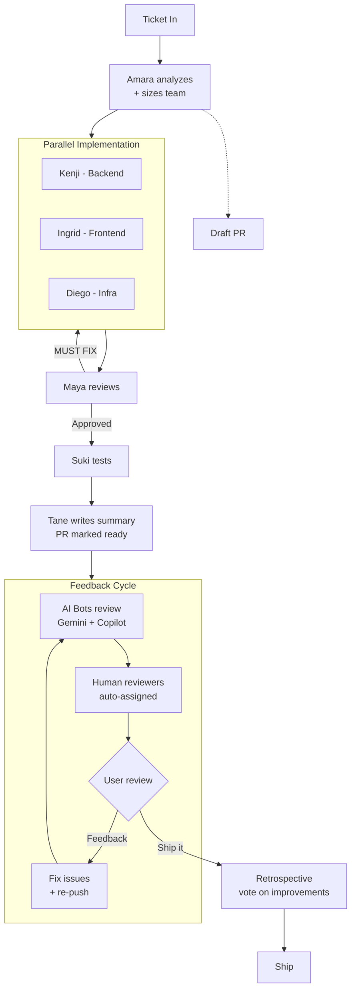
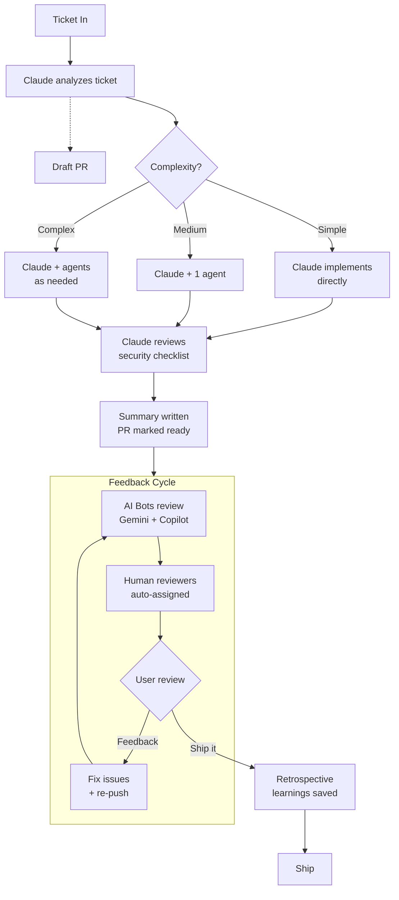
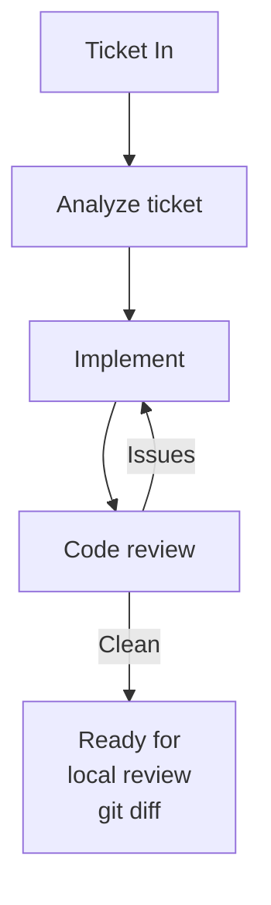

# Workflow Phases

## Full Mode (default)

Multi-agent team with full orchestration.

## Lite Mode (`--lite`)

Claude works solo or selectively spawns agents. Same quality gates and feedback cycle.

## Local Mode (`--local`)

No PR, no push. Stops after review.

## Mode Comparison

| Feature | Full | Lite | Local |
|---------|:----:|:----:|:-----:|
| Architecture analysis | Amara | Claude | Claude |
| Implementation | Parallel agents | Claude decides | Claude decides |
| Code review | Maya | Claude or Maya | Claude or Maya |
| Draft PR | yes | yes | - |
| AI bot feedback | yes | yes | - |
| Human reviewer assignment | yes | yes | - |
| User feedback loop | yes | yes | - |
| Summary | Tane | Claude | - |
| Retrospective | yes | yes | - |
| Jira transitions | yes | yes | - |

Add `--no-worktree` to any mode to skip worktree creation and work in the current directory.
