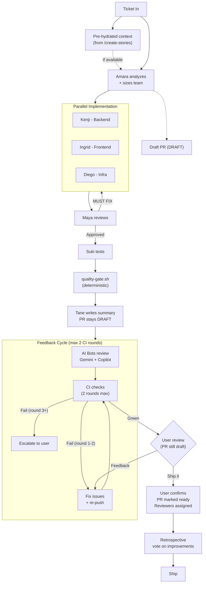
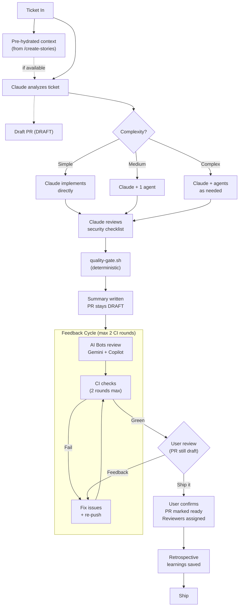
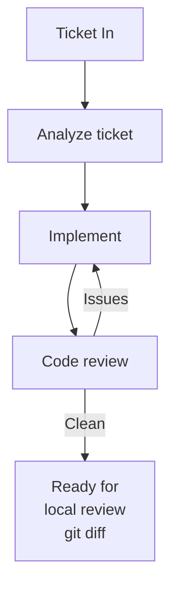

# Workflow Phases

## Full Mode (default)

Multi-agent team with full orchestration. When launched via `/create-stories`, context is pre-hydrated in parallel before the session starts — Amara validates instead of exploring from scratch.


```mermaid
flowchart TD
    Ticket["Ticket In"] --> PreHydrate["Pre-hydrated context\n(from /create-stories)"]
    PreHydrate -.->|"if available"| Amara
    Ticket --> Amara["Amara analyzes\n+ sizes team"]
    Amara -.-> Draft["Draft PR (DRAFT)"]

    subgraph Impl["Parallel Implementation"]
        Kenji["Kenji - Backend"]
        Ingrid["Ingrid - Frontend"]
        Diego["Diego - Infra"]
    end

    Amara --> Impl

    Maya["Maya reviews"]
    Impl --> Maya
    Maya -->|"MUST FIX"| Impl

    Suki["Suki tests"]
    Maya -->|"Approved"| Suki

    QualityGate["quality-gate.sh\n(deterministic)"]
    Suki --> QualityGate

    Summary["Tane writes summary\nPR stays DRAFT"]
    QualityGate --> Summary

    subgraph Feedback["Feedback Cycle (max 2 CI rounds)"]
        AIBots["AI Bots review\nGemini + Copilot"]
        CI["CI checks\n(2 rounds max)"]
        FixIssues["Fix issues\n+ re-push"]
        AIBots --> CI
        CI -->|"Fail (round 1-2)"| FixIssues
        FixIssues --> CI
        CI -->|"Fail (round 3+)"| Escalate["Escalate to user"]
    end

    Summary --> Feedback

    UserR{"User review\n(PR still draft)"}
    CI -->|"Green"| UserR

    MarkReady["User confirms\nPR marked ready\nReviewers assigned"]
    UserR -->|"Ship it"| MarkReady

    UserR -->|"Feedback"| FixIssues

    Retro["Retrospective\nvote on improvements"]
    MarkReady --> Retro
    Retro --> Ship["Ship"]
```

## Lite Mode (`--lite`)

Claude works solo or selectively spawns agents. Same quality gates and feedback cycle.


```mermaid
flowchart TD
    Ticket["Ticket In"] --> PreHydrate["Pre-hydrated context\n(from /create-stories)"]
    PreHydrate -.->|"if available"| Analyze
    Ticket --> Analyze["Claude analyzes ticket"]
    Analyze -.-> Draft["Draft PR (DRAFT)"]
    Analyze --> Decide{"Complexity?"}

    Decide -->|"Simple"| Solo["Claude implements\ndirectly"]
    Decide -->|"Medium"| One["Claude + 1 agent"]
    Decide -->|"Complex"| Multi["Claude + agents\nas needed"]

    Review["Claude reviews\nsecurity checklist"]
    Solo --> Review
    One --> Review
    Multi --> Review

    QualityGate["quality-gate.sh\n(deterministic)"]
    Review --> QualityGate

    Summary["Summary written\nPR stays DRAFT"]
    QualityGate --> Summary

    subgraph Feedback["Feedback Cycle (max 2 CI rounds)"]
        AIBots["AI Bots review\nGemini + Copilot"]
        CI["CI checks\n(2 rounds max)"]
        FixIssues["Fix issues\n+ re-push"]
        AIBots --> CI
        CI -->|"Fail"| FixIssues
        FixIssues --> CI
    end

    Summary --> Feedback

    UserR{"User review\n(PR still draft)"}
    CI -->|"Green"| UserR

    MarkReady["User confirms\nPR marked ready\nReviewers assigned"]
    UserR -->|"Ship it"| MarkReady
    UserR -->|"Feedback"| FixIssues

    Retro["Retrospective\nlearnings saved"]
    MarkReady --> Retro
    Retro --> Ship["Ship"]
```

## Local Mode (`--local`)

No PR, no push. Stops after review.


```mermaid
flowchart TD
    Ticket["Ticket In"] --> Analyze["Analyze ticket"]
    Analyze --> Implement["Implement"]
    Implement --> Review["Code review"]
    Review -->|"Issues"| Implement
    Review -->|"Clean"| Done["Ready for\nlocal review\ngit diff"]
```

## Mode Comparison

| Feature | Full | Lite | Local |
|---------|:----:|:----:|:-----:|
| Pre-hydrated context | yes (if via /create-stories) | yes (if via /create-stories) | - |
| Architecture analysis | Amara | Claude | Claude |
| Implementation | Parallel agents | Claude decides | Claude decides |
| Code review | Maya | Claude or Maya | Claude or Maya |
| Quality gate script | yes | yes | yes |
| Draft PR | yes | yes | - |
| AI bot feedback | yes | yes | - |
| CI iteration cap (2 rounds) | yes | yes | - |
| PR stays draft until user confirms | yes | yes | - |
| Human reviewer assignment | after user confirms | after user confirms | - |
| User feedback loop | yes | yes | - |
| Summary | Tane | Claude | - |
| Retrospective | yes | yes | - |
| Jira transitions | yes | yes | - |

Add `--no-worktree` to any mode to skip worktree creation and work in the current directory.

## Worktree Port Isolation

When `/create-stories` sets up a worktree, it applies port isolation automatically so multiple worktrees can run simultaneously without conflicts:

```
Ticket PROJ-1528 → number 1528 → slot 44 (1528 % 99 + 1)
  Vite:  3144
  APIs:  14401 (IAM), 14402 (Absence), 14403 (Statistics), 14405 (HCM), 14406 (Messenger)

Ticket PROJ-1857 → number 1857 → slot 76
  Vite:  3176
  APIs:  17601–17608

Main stack (no env vars set) → defaults
  Vite:  3000
  APIs:  5001–5006
```

The env-var-aware `vite.config.mts` reads `VITE_*_PORT` with fallbacks to hardcoded defaults — non-worktree users are completely unaffected.
